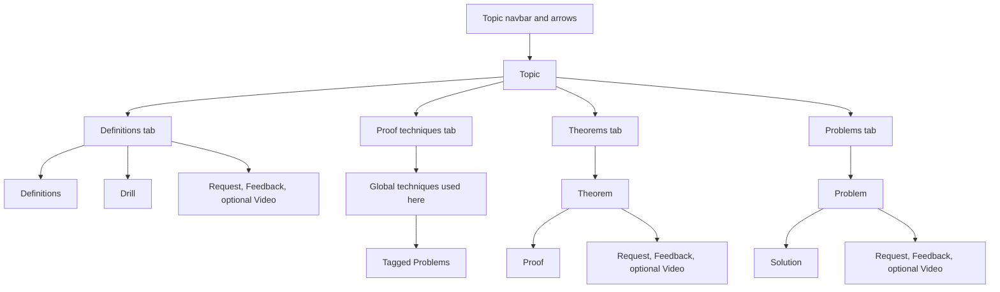

# 21-127

Unofficial supplemental resources for CMU 21-127 Concepts of Mathematics. Not a replacement for lectures or recitations. Written to Gregory Johnson's presentation; usable for other offerings. See [CONTEXT.md](CONTEXT.md).

Topics are the spine: previous/next and a navbar. Each Topic has four tabs — Definitions, Proof techniques, Theorems, and Problems. A Topic's Definitions end with a Drill. A signed-in User can Request a missing Video and leave Feedback.



```sh
npm install
bash scripts/setup.sh   # Clerk keys, D1, first deploy
npm run db:migrate:local
npm run dev
```

Pushes to `main` build, apply D1 migrations, and deploy to Cloudflare Workers. Set repository secrets `CLOUDFLARE_API_TOKEN`, `CLOUDFLARE_ACCOUNT_ID`, `CLERK_SECRET_KEY`, and `PUBLIC_CLERK_PUBLISHABLE_KEY`.
